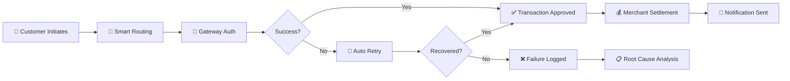

# Digital Payments Process Analysis

## Overview

This portfolio case study analyzes digital payment ecosystems — including UPI, wallets, card payments, and net banking — to identify process improvement opportunities, failure reduction strategies, and customer experience enhancements in the BFSI sector.

**Label:** Portfolio Case Study — Synthetic Scenario

## Objectives

1. Map end-to-end digital payment flows from initiation to settlement
2. Analyze payment failure patterns and root causes
3. Identify merchant settlement process gaps
4. Define customer experience improvement opportunities
5. Propose a roadmap for payment infrastructure modernization

## Key Areas

- **Payment Initiation:** UPI collect/request, wallet load, card tokenization
- **Transaction Processing:** Authorization, 2FA, NPCI switches, bank debits
- **Failure Analysis:** Network timeouts, insufficient funds, VPA errors, bank downtimes
- **Merchant Settlement:** T+0/T+1 settlement, reconciliation, chargebacks
- **Customer Experience:** Success notifications, failure recovery, refund timelines

## Deliverables

| Category | Files |
|----------|-------|
| **Data** | `payments.csv` — 30 digital payment records across channels |
| **Data** | `merchants.csv` — 15 merchant profiles with settlement details |
| **Data** | `customers.csv` — 15 customers with payment preferences |
| **Data** | `payment_failures.csv` — 10 failure records with root causes |
| **Data Dictionary** | `data_dictionary.md` — Field definitions |
| **SQL Schema** | `schema.sql` — PostgreSQL DDL with views |
| **EDA Notebook** | `analysis/eda.ipynb` — Failure analysis, channel trends, merchant metrics |
| **Requirements** | `docs/requirements.md` — Functional & non-functional requirements |
| **Gap Analysis** | `docs/gap_analysis.md` — AS-IS vs TO-BE |
| **Roadmap** | `docs/implementation_roadmap.md` — Enhancement timeline |

## Data Disclaimer

All data in this project is **synthetic and self-created** for demonstration purposes only. No real customer, bank, or transaction data is used.

---

*Created: September 2026 | Analyst: Sagar Kandelkar*

## 📊 Process Flow (Mermaid)

