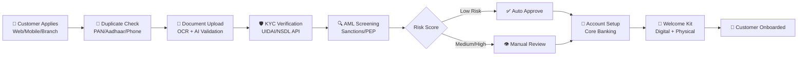
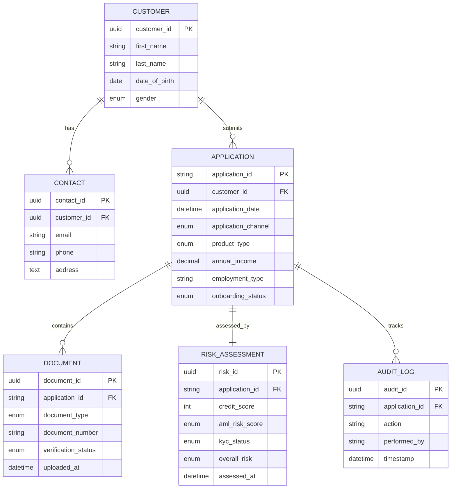

# Sagar Kandelkar - Portfolio

Welcome to my professional portfolio repository. This repository showcases my projects, case studies, and technical work across various domains including BFSI, data engineering, and analytics.

## 📁 Repository Structure

```
Sagar-Kandelkar-Portfolio/
├── 01-bfsi-customer-onboarding/    # BFSI Customer Onboarding Project
│   ├── analysis/                    # Python EDA notebooks
│   ├── dashboard/                   # Interactive HTML dashboards & presentations
│   ├── data/                        # Sample datasets, dictionaries, and SQL schema
│   ├── diagrams/                    # Architecture, ERD, and process flow diagrams
│   └── docs/                        # Project documentation and case studies
├── 02-retail-analytics/            # Retail Analytics — Customer Segmentation & Sales Optimization
│   ├── analysis/                    # Python EDA notebooks
│   ├── dashboard/                   # Interactive HTML dashboards & presentations
│   ├── data/                        # Sample datasets, dictionaries, and SQL schema
│   └── docs/                        # Project documentation and requirements
├── 03-fraud-risk-analytics/        # Fraud Detection & Risk Analytics in BFSI
│   ├── analysis/                    # Python EDA notebooks
│   ├── dashboard/                   # Interactive HTML dashboards & presentations
│   ├── data/                        # Sample datasets, dictionaries, and SQL schema
│   └── docs/                        # Project documentation and requirements
├── 04-forex-card-enhancement/        # Forex Card Lifecycle & Digital Enhancement
│   ├── analysis/                    # Python EDA notebooks
│   ├── dashboard/                   # Interactive HTML dashboards & presentations
│   ├── data/                        # Sample datasets, dictionaries, and SQL schema
│   ├── diagrams/                    # Process flows and journey maps
│   └── docs/                        # Project documentation and requirements
├── 05-digital-payments-analysis/     # Digital Payments Process Analysis
│   ├── analysis/                    # Python EDA notebooks
│   ├── dashboard/                   # Interactive HTML dashboards & presentations
│   ├── data/                        # Sample datasets, dictionaries, and SQL schema
│   ├── diagrams/                    # Payment flow diagrams
│   └── docs/                        # Project documentation and requirements
├── 06-credit-card-journey/           # Credit Card Customer Journey Mapping
│   ├── analysis/                    # Python EDA notebooks
│   ├── dashboard/                   # Interactive HTML dashboards & presentations
│   ├── data/                        # Sample datasets, dictionaries, and SQL schema
│   ├── diagrams/                    # Customer journey maps
│   └── docs/                        # Project documentation and requirements
├── .github/workflows/               # CI/CD workflows
│   ├── deploy.yml                   # React + Vite portfolio deployment
│   └── pages.yml                    # Static site deployment (manual)
└── README.md                        # This file
```

## 🚀 Projects

### 1. BFSI Customer Onboarding
A comprehensive project focused on streamlining and optimizing the customer onboarding process in the Banking, Financial Services, and Insurance sector.

**Key Areas:**
- Customer data management and validation
- KYC (Know Your Customer) process optimization
- Workflow automation
- Compliance and regulatory requirements

**Project Deliverables:**

| Category | Files |
|----------|-------|
| **Data** | `customer_applications.csv` — Sample dataset with 15 applications across channels and statuses |
| **Data Dictionary** | `data_dictionary.md` — Field definitions and data quality notes |
| **SQL Schema** | `schema.sql` — PostgreSQL DDL with tables, views, indexes, and sample data |
| **EDA Notebook** | `analysis/eda.ipynb` — Python Jupyter notebook with full exploratory data analysis |
| **BI Dashboard** | `dashboard/powerbi-style-dashboard.html` — Power BI-style interactive HTML dashboard |
| **Documentation** | `docs/README.md` — Project overview and objectives |
| **Requirements** | `requirements.md` — Functional and non-functional requirements |
| **Gap Analysis** | `gap_analysis.md` — AS-IS vs TO-BE assessment with metrics |
| **Roadmap** | `implementation_roadmap.md` — 4-phase rollout plan with timelines |
| **Process Flow** | `to_be_process_flow.drawio` — Swimlane diagram |
| **Data Model** | `entity_relationship_diagram.drawio` — ERD |
| **Demo Dashboard** | `demo-dashboard.html` — Interactive HTML dashboard with charts |
| **Presentation** | `presentation.html` — Scrollable slide deck for interviews |

**Live Demo:** [Interactive Dashboard](https://sagarkandelkar.github.io/Sagar-Kandelkar-Portfolio/01-bfsi-customer-onboarding/demo-dashboard.html)

---

### 2. Retail Analytics — Customer Segmentation & Sales Optimization
A data-driven retail analytics project demonstrating customer segmentation (RFM analysis), sales performance tracking, campaign effectiveness, and churn prediction capabilities.

**Key Areas:**
- Customer segmentation using RFM (Recency, Frequency, Monetary) scoring
- Sales trend analysis across categories, channels, and payment methods
- Marketing campaign ROI tracking and optimization
- Churn risk identification and retention strategies
- Inventory and product performance insights

**Project Deliverables:**

| Category | Files |
|----------|-------|
| **Data** | `customers.csv` — 20 customer records with RFM scores and segments |
| **Data** | `transactions.csv` — 25 transaction records across categories and channels |
| **Data** | `products.csv` — 25 product records with margins and stock levels |
| **Data** | `campaigns.csv` — 6 marketing campaigns with budget and revenue data |
| **Data Dictionary** | `data_dictionary.md` — Field definitions for all datasets |
| **SQL Schema** | `schema.sql` — PostgreSQL DDL for customers, products, transactions, campaigns |
| **EDA Notebook** | `analysis/eda.ipynb` — Python notebook with RFM analysis, sales trends, campaign ROI |
| **Dashboard** | `dashboard/retail-dashboard.html` — Interactive HTML dashboard with Chart.js |
| **Presentation** | `dashboard/presentation.html` — Scrollable slide deck for interviews |
| **Documentation** | `docs/README.md` — Project overview and objectives |
| **Requirements** | `requirements.md` — Functional requirements for segmentation, analytics, campaigns |
| **Gap Analysis** | `gap_analysis.md` — AS-IS vs TO-BE assessment with recommendations |
| **Roadmap** | `implementation_roadmap.md` — 3-phase rollout plan |

**Live Demo:** [Retail Dashboard](https://sagarkandelkar.github.io/Sagar-Kandelkar-Portfolio/02-retail-analytics/dashboard/retail-dashboard.html)

---

### 3. Fraud Detection & Risk Analytics
A BFSI fraud analytics portfolio case study demonstrating real-time risk scoring, rule-based alerting, and fraud pattern analysis across transaction channels.

**Key Areas:**
- Transaction monitoring and risk scoring (amount, geography, time, velocity)
- Rule-based alert generation and triage
- Fraud pattern analysis (off-hours, geo-anomaly, velocity)
- Alert investigation workflow and audit trail
- Channel risk analysis (Branch, Internet Banking, UPI, Mobile, POS)

**Project Deliverables:**

| Category | Files |
|----------|-------|
| **Data** | `transactions.csv` — 25 synthetic transactions with fraud flags and risk scores |
| **Data** | `alerts.csv` — 7 open fraud alerts with assigned investigators |
| **Data Dictionary** | `data_dictionary.md` — Field definitions for transactions and alerts |
| **SQL Schema** | `schema.sql` — PostgreSQL DDL with tables and 5 analytical views |
| **EDA Notebook** | `analysis/eda.ipynb` — Python notebook with fraud distribution, hourly patterns, channel risk, correlation |
| **Dashboard** | `dashboard/fraud-dashboard.html` — Interactive HTML dashboard with Chart.js |
| **Presentation** | `dashboard/presentation.html` — Scrollable slide deck for interviews |
| **Documentation** | `docs/README.md` — Project overview and synthetic data disclaimer |
| **Requirements** | `docs/requirements.md` — Functional and non-functional requirements |
| **Gap Analysis** | `docs/gap_analysis.md` — AS-IS vs TO-BE with metrics and recommendations |
| **Roadmap** | `docs/implementation_roadmap.md` — 3-phase rollout with timeline and budget |

**Live Demo:** [Fraud Detection Dashboard](https://sagarkandelkar.github.io/Sagar-Kandelkar-Portfolio/03-fraud-risk-analytics/dashboard/fraud-dashboard.html)

---

### 4. Forex Card Enhancement Study
A BFSI product enhancement case study analyzing the complete Forex card lifecycle — from digital application and multi-currency loading to spending, repatriation, and customer support — to identify digital transformation opportunities.

**Key Areas:**
- Forex card application and digital KYC
- Multi-currency wallet management and rate transparency
- Real-time spend tracking and LRS limit monitoring
- Unused balance repatriation and card self-service
- Customer segmentation by travel behavior

**Project Deliverables:**

| Category | Files |
|----------|-------|
| **Data** | `forex_customers.csv` — 20 customers with LRS limits |
| **Data** | `forex_cards.csv` — 20 card records with status and balances |
| **Data** | `forex_transactions.csv` — 30 transactions across 9 currencies |
| **Data** | `fx_rates.csv` — 9 currency pairs with buy/sell rates |
| **Data Dictionary** | `data_dictionary.md` — Field definitions |
| **SQL Schema** | `schema.sql` — PostgreSQL DDL with 6 analytical views |
| **EDA Notebook** | `analysis/eda.ipynb` — Currency usage, spend patterns, LRS tracking |
| **Dashboard** | `dashboard/forex-dashboard.html` — Interactive HTML dashboard with Chart.js |
| **Presentation** | `dashboard/presentation.html` — Scrollable slide deck for interviews |
| **Documentation** | `docs/README.md` — Project overview |
| **Requirements** | `docs/requirements.md` — Functional and non-functional requirements |
| **Gap Analysis** | `docs/gap_analysis.md` — AS-IS vs TO-BE with metrics |
| **Roadmap** | `docs/implementation_roadmap.md` — 6-month enhancement timeline |

**Live Demo:** [Forex Card Dashboard](https://sagarkandelkar.github.io/Sagar-Kandelkar-Portfolio/04-forex-card-enhancement/dashboard/forex-dashboard.html)

---

### 5. Digital Payments Process Analysis
A process improvement case study analyzing digital payment ecosystems — UPI, wallets, cards, and net banking — to identify failure reduction strategies, settlement optimization, and customer experience enhancements.

**Key Areas:**
- Payment success rate analysis by channel
- Failure root cause classification and recovery
- Merchant settlement cycle optimization
- Chargeback management and dispute resolution
- Customer payment preference and LTV segmentation

**Project Deliverables:**

| Category | Files |
|----------|-------|
| **Data** | `customers.csv` — 15 customers with payment preferences |
| **Data** | `merchants.csv` — 15 merchant profiles with settlement terms |
| **Data** | `payments.csv` — 30 payment records with success/failure status |
| **Data** | `payment_failures.csv` — 10 failure records with retry data |
| **Data Dictionary** | `data_dictionary.md` — Field definitions |
| **SQL Schema** | `schema.sql` — PostgreSQL DDL with 5 analytical views |
| **EDA Notebook** | `analysis/eda.ipynb` — Failure analysis, channel trends, settlement delays |
| **Dashboard** | `dashboard/payments-dashboard.html` — Interactive HTML dashboard with Chart.js |
| **Presentation** | `dashboard/presentation.html` — Scrollable slide deck for interviews |
| **Documentation** | `docs/README.md` — Project overview |
| **Requirements** | `docs/requirements.md` — Functional and non-functional requirements |
| **Gap Analysis** | `docs/gap_analysis.md` — AS-IS vs TO-BE with metrics |
| **Roadmap** | `docs/implementation_roadmap.md` — 6-month improvement timeline |

**Live Demo:** [Digital Payments Dashboard](https://sagarkandelkar.github.io/Sagar-Kandelkar-Portfolio/05-digital-payments-analysis/dashboard/payments-dashboard.html)

---

### 6. Credit Card Customer Journey Mapping
A customer experience case study mapping the complete credit card lifecycle — application, approval, activation, usage, rewards, and retention — to identify friction points and engagement opportunities.

**Key Areas:**
- Application-to-activation funnel analysis
- Credit limit assignment and utilization patterns
- Spend analysis by merchant category and channel
- Rewards accrual, redemption, and expiry management
- Customer segmentation and retention risk signals

**Project Deliverables:**

| Category | Files |
|----------|-------|
| **Data** | `applications.csv` — 20 applications across statuses |
| **Data** | `customers.csv` — 20 customers with credit profiles |
| **Data** | `transactions.csv` — 30 spend transactions |
| **Data** | `rewards.csv` — 30 reward records with redemptions |
| **Data Dictionary** | `data_dictionary.md` — Field definitions |
| **SQL Schema** | `schema.sql` — PostgreSQL DDL with 6 analytical views |
| **EDA Notebook** | `analysis/eda.ipynb` — Funnel analysis, spend patterns, rewards utilization |
| **Dashboard** | `dashboard/creditcard-dashboard.html` — Interactive HTML dashboard with Chart.js |
| **Presentation** | `dashboard/presentation.html` — Scrollable slide deck for interviews |
| **Documentation** | `docs/README.md` — Project overview |
| **Requirements** | `docs/requirements.md` — Functional and non-functional requirements |
| **Gap Analysis** | `docs/gap_analysis.md` — AS-IS vs TO-BE with metrics |
| **Roadmap** | `docs/implementation_roadmap.md` — 6-month enhancement timeline |

**Live Demo:** [Credit Card Journey Dashboard](https://sagarkandelkar.github.io/Sagar-Kandelkar-Portfolio/06-credit-card-journey/dashboard/creditcard-dashboard.html)

---

### 📊 Process Flow (Mermaid)



### 🗄️ Data Model (Mermaid ERD)



---

## 🛠️ Tech Stack

- **Data:** SQL, Python (Pandas, NumPy, Matplotlib, Seaborn), Excel
- **Visualization:** Power BI, Tableau, Draw.io, Chart.js
- **Documentation:** Markdown, Confluence
- **Version Control:** Git, GitHub
- **CI/CD:** GitHub Actions (GitHub Pages deployment for React + Vite)

## 📫 Contact

- **GitHub:** [@sagarkandelkar](https://github.com/sagarkandelkar)
- **LinkedIn:** [Sagar Kandelkar](https://linkedin.com/in/sagarkandelkar)

---

*This portfolio is a work in progress. New projects and updates are added regularly.*
