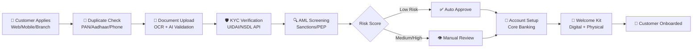
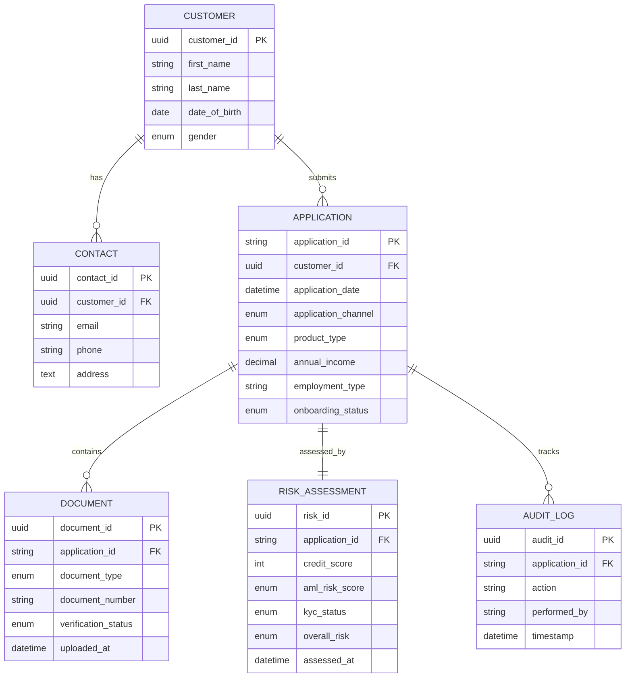

# Sagar Kandelkar - Portfolio

Welcome to my professional portfolio repository. This repository showcases my projects, case studies, and technical work across various domains including BFSI, data engineering, and analytics.

## 📁 Repository Structure

```
Sagar-Kandelkar-Portfolio/
├── 01-bfsi-customer-onboarding/    # BFSI Customer Onboarding Project
│   ├── data/                        # Sample datasets, dictionaries, and SQL schema
│   ├── diagrams/                    # Architecture, ERD, and process flow diagrams
│   └── docs/                        # Project documentation and case studies
└── README.md                        # This file
```

## 🚀 Projects

### 1. BFSI Customer Onboarding
A comprehensive project focused on streamlining and optimizing the customer onboarding process in the Banking, Financial Services, and Insurance sector.

**Key Areas:**
- Customer data management and validation
- KYC (Know Your Customer) process optimization
- Workflow automation
- Compliance and regulatory requirements

**Project Deliverables:**

| Category | Files |
|----------|-------|
| **Data** | `customer_applications.csv` — Sample dataset with 15 applications across channels and statuses |
| **Data Dictionary** | `data_dictionary.md` — Field definitions and data quality notes |
| **SQL Schema** | `schema.sql` — Database table creation scripts from the ERD |
| **Documentation** | `docs/README.md` — Project overview and objectives |
| **Requirements** | `requirements.md` — Functional and non-functional requirements |
| **Gap Analysis** | `gap_analysis.md` — AS-IS vs TO-BE assessment with metrics |
| **Roadmap** | `implementation_roadmap.md` — 4-phase rollout plan with timelines |
| **Process Flow** | `to_be_process_flow.drawio` — Swimlane diagram |
| **Data Model** | `entity_relationship_diagram.drawio` — ERD |
| **Demo Dashboard** | `demo-dashboard.html` — Interactive HTML dashboard with charts |
| **Presentation** | `presentation.html` — Scrollable slide deck for interviews |

**Live Demo:** [Interactive Dashboard](https://sagarkandelkar.github.io/Sagar-Kandelkar-Portfolio/01-bfsi-customer-onboarding/demo-dashboard.html)

---

### 📊 Process Flow (Mermaid)



### 🗄️ Data Model (Mermaid ERD)



---

## 🛠️ Tech Stack

- **Data:** SQL, Python, Excel
- **Visualization:** Power BI, Tableau, Draw.io
- **Documentation:** Markdown, Confluence
- **Version Control:** Git, GitHub
- **CI/CD:** GitHub Actions (GitHub Pages deployment)

## 📫 Contact

- **GitHub:** [@sagarkandelkar](https://github.com/sagarkandelkar)
- **LinkedIn:** [Sagar Kandelkar](https://linkedin.com/in/sagarkandelkar)

---

*This portfolio is a work in progress. New projects and updates are added regularly.*
